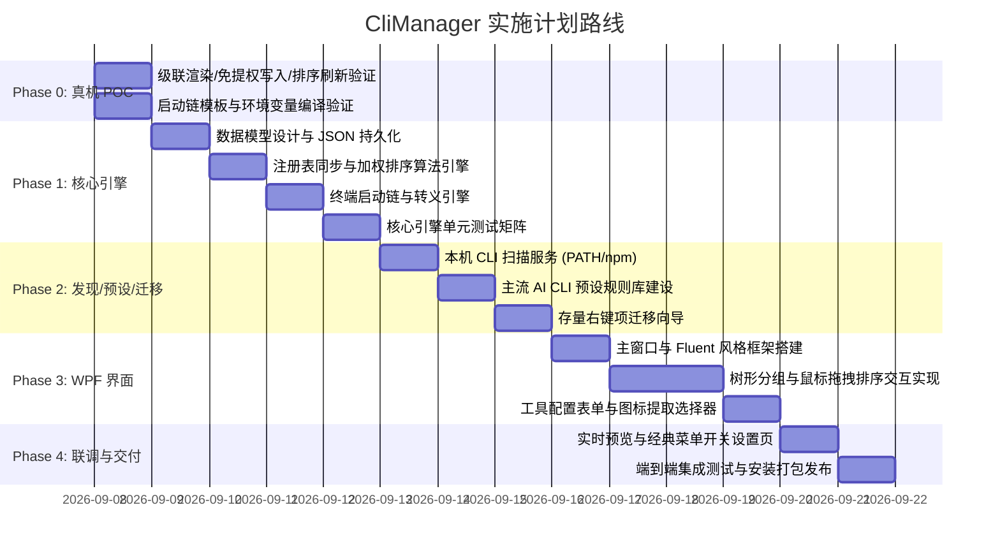

# 开发终端管理工具 CliManager (cli-manager) — 需求与架构规划方案

> 文档版本：v1.3  
> 状态：Phase 0 POC 已通过（2026-09-08），Phase 1 开发中  
> 目标平台：Windows 10 / Windows 11（当前开发机：Windows 11 25H2, build 26200）  

---

## 〇、修订记录与关键决策

### 修订记录

| 版本 | 日期 | 变更摘要 |
|---|---|---|
| v1.0 | 2026-09-08 | 初版规划 |
| v1.1 | 2026-09-08 | ① 新增 Windows 11 菜单策略与"恢复经典菜单"开关规范（§3.6）；② 启动链确定为**直写命令**架构，补全转义规范与测试矩阵（§3.3）；③ 新增存量右键项迁移规范（§3.7）；④ 新增 Phase 0 真机 POC（§五）；⑤ 修正探测路径硬编码、pwsh 默认值、便携模式配置矛盾等细节；⑥ 数据模型明确 GUID 身份与 targets 字段 |
| v1.1.1 | 2026-09-08 | 复核修订：① 修正修订记录章节引用（§六→§五）；② 数据模型补充 `keepOpen` 字段（对齐迁移章节语义）；③ 新增 REG_SZ 值类型规则与 wt 绝对路径规则；④ `Position=Top` 移至后续版本；⑤ 备份目录、npm 探测命令、经典菜单回退键名等精度修正 |
| v1.1.2 | 2026-09-08 | 产品命名统一：DevTerminal → **CliManager**（对外显示名），仓库/包标识 **cli-manager**；受管标记改为 `CliManager.Managed`，配置目录改为 `%APPDATA%\CliManager` |
| v1.2 | 2026-09-08 | 新增 §2.1 解决方案分层与 UI 演进策略（架构守则）：`CliManager.Core` / `CliManager.App` 强制分层、视觉值零硬编码、复杂交互逻辑入 ViewModel；新增决策 D5 与对应验收项。起因：评审"后期 UI 重构友好度" |
| v1.3 | 2026-09-08 | **Phase 0 真机 POC 全部通过**（级联渲染/免提权/排序刷新/启动链模板），决策：级联采用 `SubCommands=""` 写法；刷新机制实测无需 SHChangeNotify（仅图标缓存保留）；按实测修正 §3.3.2 规则 6/7（`%%` 非命令行转义、`%` 两段替换模型）。详见 [Phase0-POC结论.md](Phase0-POC结论.md) |

### 关键决策记录（ADR）

| 编号 | 决策 | 结论 | 理由 |
|---|---|---|---|
| D1 | 启动架构：直写命令 vs 启动器中转 | **直写命令字符串** | 零运行时依赖：卸载/移动管理器后菜单仍然可用。旧版 RightMenu 采用"启动器中转"，启动器 exe 被移动后注册表全部变死链（本机 `在 Kiro-cli 中打开` 即为实证）。直写的转义风险由 §3.3 转义规范 + Phase 0 POC + 测试矩阵消化 |
| D2 | Win11 新版菜单应对策略 | **内置"恢复经典菜单"可选开关**（§3.6） | 纯注册表静态项在 Win11 默认收进"显示更多选项"二级层；开关一键应用/撤销，状态可检测，效果全局透明告知 |
| D3 | 注册面范围（v0.0.1） | **仅 `Directory\Background\shell`**（文件夹空白处） | 覆盖核心场景；数据模型预留 `targets` 字段，后续版本扩展 `Directory\shell`（文件夹本体）、`Drive\shell`（盘符） |
| D4 | 存量项迁移时机 | **v0.0.1 即做**：扫描 → 导入接管 → 可选清理（§3.7） | 本机现存 15+ 个分散在 HKLM/HKCU 的旧右键项，首版不做迁移则新旧条目并存重复，首运行体验即受损 |
| D5 | 后期 UI 重构友好度 | **Core/App 强制分层；WPF-UI 定位为可替换皮肤层** | UI 演进三条路径（换肤 / 改布局 / 换视图框架）均不触碰核心引擎；守则见 §2.1 |

---

## 一、项目背景与核心价值

### 1.1 核心痛点
随着 AI 驱动开发的普及，开发者本地安装了大量针对特定场景的 CLI 终端工具（例如：**Claude Code**、**OpenCode**、**Codex**、**Kimi CLI**、**Kiro CLI**、**Gemini CLI** 等）。日常使用中存在以下痛点：
1. **工作目录流转繁琐**：每次使用都必须在目标项目文件夹打开终端，并手动输入命令，步骤繁琐且机械。
2. **注册表维护成本高**：手动在 `regedit.exe` 的 `Directory\Background\shell` 下添加右键项门槛高、易写错 `%V` 传参及引号转义，且缺少图标提取与管理能力。
3. **右键菜单过度膨胀**：平铺多个 CLI 工具会导致资源管理器右键菜单极其冗长，严重挤占日常操作空间。
4. **终端环境多样且缺少统一管理**：不同 CLI 需要不同的运行宿主（Windows Terminal、CMD、PowerShell、Warp）或需要特定的网络代理环境变量（如 `HTTP_PROXY`）。
5. **存量配置散乱且会腐坏**：本机右键项分散于 HKLM 与 HKCU 两处、由多代工具与手工编辑产生，且已出现指向已删除路径的死链条目，无人统一治理。

### 1.2 解决方案与定位
打造一款专为**开发者（尤其是 AI CLI 重度用户）**设计的本地终端/开发工具右键管理软件：
- **统一可视化配置**：图形化添加、修改、启用/禁用所有开发 CLI 工具。
- **自定义右键菜单文件夹（级联子菜单）**：类似原生"新建 ▷"，支持创建如"AI 编程工具 ▷"，将多个 CLI 工具收拢归纳。
- **全流程拖拽自定义排序**：支持鼠标拖拽调整工具在菜单内的前后顺序。
- **智能探测与一键预设**：自动扫描本机已安装的 AI CLI 工具，并提供常见工具的一键预填模板。
- **存量迁移**：首次运行扫描本机现存右键项，备份后一键导入接管，可清理死链与冗余。
- **Win11 菜单可选治理**：内置"恢复经典菜单"开关，决定条目出现在一级菜单还是"显示更多选项"内。
- **用户态运行，日常零提权**：受管注册表写入 100% 位于 `HKCU`；仅清理 HKLM 存量项时提供**可选的一次性**提权流程。

---

## 二、技术栈评估与终审决策

抛开历史资产影响，从该工具的核心系统级特征出发，进行横向多方案对比：

| 评估维度 | .NET 10 + WPF (WPF-UI) | Tauri v2 (Rust + 前端) | Wails v3 (Go + Web) | WinUI 3 (Windows App SDK) |
|---|---|---|---|---|
| **注册表与 Win32 原生操作** | **一等 BCL 支持**，无胶水层 | 依赖第三方 crate，处理多类型注册表较繁琐 | 依赖 `golang.org/x/sys/windows` | 原生支持 |
| **图标提取与渲染** | **Win32 Shell 直连**，直接绑定 UI 控件 | 提取 HICON 需转 Base64 走 IPC 桥接穿透 | 需转 Base64 走桥接 | 原生支持 |
| **终端启动链防注入** | `ProcessStartInfo.ArgumentList` 数组安全传参 | 良好 | 良好 | 原生支持 |
| **拖拽交互与视觉质感** | **成熟 WPF 拖拽模型**，WPF-UI 具备原生 Fluent/Mica 质感 | 前端拖拽生态好，但有 WebView2 运行时开销 | 同 Tauri | 拖拽相对较新，生态小 |
| **冷启动速度** | <600ms（原生无 WebView 初始化） | 需等待 WebView2 引擎冷启动 | 需等待 WebView2 | 中等 |
| **系统侵入性与依赖** | 纯用户态，发布支持单目录自包含 | 纯用户态 | 纯用户态 | MSIX/AppSDK 依赖较重 |

### 🏆 最终选型：**.NET 10 LTS + WPF + WPF-UI + CommunityToolkit.Mvvm**
- **开发语言/框架**：C# 13 / .NET 10 LTS (`net10.0-windows`)
- **界面与样式库**：[WPF-UI](https://wpfui.lepo.co/)（提供原生 Windows 11 Fluent Design、Mica 毛玻璃材质、深浅主题自动跟随与精致现代控件）
- **架构模式**：MVVM（基于 `CommunityToolkit.Mvvm` 源生成器，强类型且零反射性能损耗）
- **构建产物**：免安装绿色版（Portable ZIP）及一键轻量安装包。

> 注：.NET 10 为当时最新 LTS；若开发时 .NET 10 尚未 GA，则回落到 .NET 8 LTS， API 面完全兼容，不影响本方案任何设计。

### 2.1 解决方案分层与 UI 演进策略（架构守则）

> 本节为强制约定（决策 D5）。目的：保证后期任何级别的 UI 重构——换肤、改布局、乃至更换视图框架——都不触碰核心引擎。

**解决方案结构：**

```text
CliManager.sln
├── CliManager.Core        # 类库：零 WPF/UI 依赖
│   ├── Models/            #   数据模型（config.json 映射）
│   ├── Registry/          #   RegistrySyncEngine、级联键读写、特征标记
│   ├── Launch/            #   转义引擎与宿主模板编译（§3.3）
│   ├── Detection/         #   CLI 探测、预设匹配（§3.4）
│   ├── Migration/         #   存量扫描与导入（§3.7）
│   └── Icons/             #   图标提取（HICON → PNG 字节，不绑定 UI 控件）
├── CliManager.App         # WPF 宿主：视图 + ViewModel（CommunityToolkit.Mvvm）
└── CliManager.Tests       # Core 单元测试矩阵（§3.3.3 等）
```

**三条硬性纪律：**
1. **UI 层禁止直接访问注册表与系统资源**：一切经由 Core 服务接口；`CliManager.Core` 的编译引用中不允许出现任何 UI 框架程序集（可在 CI 中机检）。
2. **视觉值零硬编码**：颜色、字体、间距全部走资源字典；界面文案走资源文件（兼做未来 i18n 基础）。
3. **复杂交互逻辑放 ViewModel/Behavior**：树形拖拽排序等交互不得堆在 code-behind。

**UI 演进路径预置：**

| 未来需求 | 做法 | 触碰范围 |
|---|---|---|
| 视觉精修 / 换肤 | 重写主题资源字典与控件模板；必要时替换 WPF-UI（MahApps / HandyControl / 自绘） | 仅 App 视图层 |
| 大改交互布局 | 重写 XAML 视图 | App 视图 + 少量 ViewModel 调整 |
| 更换视图技术（如 WebView2 混合、其他框架） | 重写视图层，Core 原样复用（可另加 CLI 入口供任意前端调用） | 视图框架层 |

**WPF-UI 定位**：视为"可替换的皮肤层"使用；核心交互控件（TreeView/ListBox 拖拽）优先基于 WPF 原生能力自行控制，降低对社区库版本变更的耦合。

---

## 三、核心功能规范与系统架构

### 3.1 菜单组织结构：顶级直出 + 一级级联文件夹
系统支持混合组织模式，用户可自由规划右键形态：
- **顶级直出项**：高频核心工具（如最常用的 Claude Code）直接排布在右键一级菜单，一击即发。
- **自定义菜单文件夹（一级子菜单）**：
  - 用户可创建多个文件夹（如 `📂 AI 编程工具 ▷`、`📂 常用终端 ▷`）。
  - 每个文件夹支持配置：**显示名称（MUIVerb）**、**专属图标（Icon）**、**启用/禁用状态**。
  - **层级约束**：严格限定为**一级子菜单**（右键 ➔ 文件夹 ➔ CLI 工具），避免多层级联导致的鼠标操作容易滑出/误触问题。
- **单条目控制**：
  - 启用/禁用通过写入/删除 `LegacyDisable` 值实现（键保留，无需删键重建）。
  - 顶级项 `Position=Top` 置顶列为**后续版本增强**（仅经典菜单下生效，见 §3.6；v0.0.1 不实现，避免 UI 与注册表行为不一致）。

```text
📁 文件夹空白处右击
│
├── 🤖 Claude Code (常用直出项)
│
├── 📂 AI 编程工具 ▷  ─────────────────┐ (自定义菜单文件夹)
│                                       ├── 1. OpenCode
│                                       ├── 2. Codex
│                                       └── 3. Kimi CLI
│
├── 📂 调试终端 ▷   ───────────────────┐
│                                       ├── 1. Windows Terminal
│                                       └── 2. Warp
└── 其他系统原有菜单项...
```

> ⚠️ 上图为经典菜单（或 Win10）下的形态；Windows 11 默认新版菜单中的呈现方式见 §3.6。

---

### 3.2 排序算法与注册表底层映射规范

#### 3.2.1 注册表级联结构标准
在 Windows 静态右键菜单体系中，通过在父级项添加 `SubCommands=""` 并在其子级建立 `shell` 节点实现纯注册表级联；微软文档推荐的等效写法为 `ExtendedSubCommandsKey` 指向自身。**两种写法均在 Phase 0 于真机（Win11 25H2）验证后择优固化**，以下示例采用 `SubCommands` 写法。全部写入当前用户配置：

```ini
; 1. 自定义文件夹（父级）
[HKEY_CURRENT_USER\Software\Classes\Directory\Background\shell\010_AIFolder]
"MUIVerb"="AI 编程工具"
"SubCommands"=""
"Icon"="C:\\Path\\To\\FolderIcon.ico"
"CliManager.Managed"=dword:00000001

; 2. 文件夹内的子项（子级 shell 节点）
[HKEY_CURRENT_USER\Software\Classes\Directory\Background\shell\010_AIFolder\shell\010_opencode]
"MUIVerb"="OpenCode"
"Icon"="D:\\Software\\nodejs\\opencode.exe,0"

[HKEY_CURRENT_USER\Software\Classes\Directory\Background\shell\010_AIFolder\shell\010_opencode\command]
@="cmd.exe /d /c pushd \"%V\" && \"D:\\Software\\nodejs\\opencode.exe\""
```

#### 3.2.2 自定义拖拽排序底层保障机制
- **原理**：Windows 资源管理器在枚举 `shell` 下的子项时，按**注册表子键名（Key Name）的字典序**展示。
- **实现**：
  - 界面呈现文字完全由注册表中的 `MUIVerb` 字符串决定（对用户完全透明，展示如 "OpenCode"、"Claude Code"）。
  - 底层注册表子键名采用**自增步长加权格式**：`{Order:D3}_{SafeToolId}`（例如 `010_Claude`、`020_OpenCode`、`030_Codex`）。数字前缀（ASCII 小于字母）使全部受管项天然形成一个**连续区块**，与非受管项（如系统 `cmd`、`Powershell`）在排序上不交错。
  - 保存时全量重编号（宽度 = max(3, 项数位数+1)，超过 99 项自动升宽），拖拽后重命名对应键即可，**确保右键菜单中的实际展示顺序与 UI 拖拽顺序 100% 严格一致**。
  - 顶级目录下**文件夹与直出工具统一参与同一套编号序列**，即文件夹之间、文件夹与直出项之间的相对顺序也可拖拽。
- **刷新**：每次注册表写入完成后调用 `SHChangeNotify`（`SHCNE_ASSOCCHANGED`）触发资源管理器刷新菜单与图标缓存，避免用户手动重启 explorer（Phase 0 验证有效性）。

---

### 3.3 终端宿主适配链 (Launch Chain)

> **架构决策 D1：直写命令字符串**。注册表 `command` 中直接写入完整启动命令，不经过管理器 exe 中转，保证卸载/移动管理器后菜单依然可用。作为交换，命令字符串的**转义必须遵循本节规范**，并以 Phase 0 真机验证 + 单元测试矩阵兜底。

#### 3.3.1 宿主命令模板（canonical templates）

| 终端宿主 | 命令模板 | 说明 |
|---|---|---|
| **Windows Terminal** | `wt.exe -d "%V" cmd.exe /d /c "<EXE>" <ARGS>` | 推荐首选；标签页原生。**写入注册表时使用探测到的 wt.exe 绝对路径**（用户级执行别名在提权 explorer 等特殊上下文可能失效；探测不到 wt 时从候选中剔除） |
| **经典 CMD** | `cmd.exe /d /c pushd "%V" && "<EXE>" <ARGS>` | 稳定兜底。`/d` 跳过 AutoRun 防用户脚本污染；`pushd` 替代 `cd /d`（额外支持 UNC 路径自动映射临时盘符） |
| **Windows PowerShell** | `powershell.exe -NoExit -Command "Set-Location -LiteralPath '%V'; & '<EXE>' <ARGS>"` | 系统自带（Win10+），**作为 PS 系默认**，无需探测 |
| **PowerShell 7** | `pwsh.exe -NoExit -Command "Set-Location -LiteralPath '%V'; & '<EXE>' <ARGS>"` | 仅探测到 pwsh 时出现在候选中 |
| **自定义终端** | 用户模板字符串，支持占位符 `%V`、`%EXE%`、`%ARGS%` | 适配 Warp、WezTerm、Cmder、Git Bash 等 |

**保持打开（keepOpen，默认关闭）**：每个工具可独立配置"命令执行完毕后是否保留终端窗口"（对齐旧版 RightMenu 的 KeepOpen 语义，迁移时可无损转换）：CMD/WT 内层在 `/c`（退出即关）与 `/k`（保留）间切换；PowerShell 系在 `-Command` 与 `-NoExit -Command` 间切换。

**环境变量注入（编译期完成）**：纯注册表方案没有运行时，环境变量在**生成 command 字符串时**编译为宿主前缀：
- CMD/WT 系：`set "K=V" &&` 前缀（WT 内层由 cmd 承载）；
- PowerShell 系：`$env:K='V'; ` 前缀；
- 值中的引号与特殊字符按 §3.3.2 规则转义后嵌入。

#### 3.3.2 转义规范（Escape Specification）

所有 `command` 均为**经 explorer → 宿主（cmd / wt / powershell）多层解析的单一字符串**，规则如下：

1. **`%V` 一律双引号包裹**：`"%V"`。反例（本机现存）：`cmd /c cd /d %V && claude`——路径含空格即失效，此类旧条目在迁移时自动修复（§3.7）。
2. **UNC 路径**：CMD 系用 `pushd`（自动映射临时盘符）；PowerShell 系 `Set-Location -LiteralPath` 原生支持 UNC。
3. **EXE 路径**：一律双引号包裹（PowerShell 单引号包裹）。路径内出现双引号属非法路径，录入时校验拒绝。
4. **PowerShell 单引号转义**：路径/参数中的 `'` 一律改写为 `''`（成对 doubling）。
5. **wt.exe 分号陷阱**：`;` 是 wt 的命令分隔符，用户参数中的 `;` 必须转义为 `\;`。
6. **CMD 元字符**：参数中的 `& | < > ^ %` 属 CMD 元字符，编译时按 CMD 规则转义（`^` 引导）；**字面 `%` 不使用 `%%` 转义**（cmd 命令行上下文中 `%%` 不折叠，POC 实测），改为编译后整串校验（见规则 7）。无法安全转义的输入在 UI 录入时给出警告。
7. **`%` 两段替换模型（Phase 0 实测固化）**：① explorer 启动前对存储值做**动词参数替换**——`%V`/`%W`/`%L`/`%1`-`%9` 等被直接替换（实测 `%WINDIR%` 被拆为 `%W`=当前目录 + 残留 `INDIR%` 而损坏；`%VX%` 被拆为 `%V`+`X`）；② cmd 收到后再展开 `%VAR%`（已定义→值，未定义→原样保留）。引擎规则：**禁止**将 `%ENV%` 形式的环境变量引用写入 command（env 一律走 set/$env: 前缀）；用户输入中的字面 `%` 须校验其后不得紧跟动词参数字符、整条编译结果不得形成可折叠的 `%name%` 对，不通过则 UI 警告。
8. **参数建模**：参数在数据模型中为**列表**（见 §3.5.4），编译期逐项转义后拼接，杜绝整串自由文本注入。
9. **值类型**：`command` 与 `Icon` 的默认值一律以 **REG_SZ** 写入，避免 REG_EXPAND_SZ 触发环境变量二次展开（与规则 7 的 `%` 语义叠加放大风险）。

#### 3.3.3 转义测试矩阵（Phase 1 单元测试 + Phase 4 端到端共用）

| 维度 | 用例示例 |
|---|---|
| 路径含空格 | `D:\My Tools\opencode.exe` |
| 路径含中文 | `D:\软件\工具.exe` |
| 路径含 CMD 元字符 | `D:\a&b\tool.exe`、参数 `--prompt "hi & bye"` |
| 路径含单引号（PS 宿主） | `D:\O'Brien\tool.exe` |
| 路径含 `%` | `D:\100%\tool.exe` |
| 参数含分号（WT 宿主） | `--mcp "a;b"` |
| UNC 工作目录 | `\\server\share\repo` |
| `%V` 为空 | 库文件夹（Libraries）等无文件系统路径场景：命令应优雅失败或提示，不弹错误窗 |
| 超长路径 | >260 字符路径（长路径前缀处理） |
| 环境变量值含空格/引号 | `HTTP_PROXY=http://127.0.0.1:7899`、`NOTE=a "b" c` |

---

### 3.4 智能探测与预设中心

#### 3.4.1 自动探测范围
系统启动时或点击"刷新探测"时，无锁扫描以下位置（**全部由环境变量/标准命令推导，不硬编码任何个人机器路径**）：
1. **全局 npm/pnpm/yarn 路径**：执行 `npm prefix -g`、`npm root -g`（`npm bin -g` 自 npm v9 起已移除，不采用）与 `pnpm bin -g` 推导全局 bin 目录，并扫描 `%APPDATA%\npm` 等标准位置，定位 `opencode`、`codex` 等 `.cmd/.exe/.ps1`。
2. **用户本地工具目录**：`%USERPROFILE%\.local\bin`（Claude Code 默认安装位置）、`%LOCALAPPDATA%\Programs`。
3. **PATH × PATHEXT 解析**：遍历用户与系统 `PATH`，结合 `PATHEXT` 解析同名可执行（`.exe` 优先于 `.cmd`）。
4. **Python Scripts 目录**：`%LOCALAPPDATA%\Programs\Python\*\Scripts` 及 `pip` 可发现的全局脚本目录。

#### 3.4.2 内置预设推荐
识别到已安装的工具后，自动匹配内置预设库，提供一键预填规则：

| 工具 | 显示名称 | 终端宿主推荐 | 图标策略 |
|---|---|---|---|
| Claude Code | `Claude Code` | Windows Terminal | 抓取 `claude.exe` 内嵌图标 |
| OpenCode | `OpenCode` | Windows Terminal | `.exe` 抓内嵌图标；`.cmd` 走兜底 |
| Codex | `Codex CLI` | Windows Terminal | `.cmd` 无图标资源，**使用内置图标库兜底** |
| Kimi CLI | `Kimi CLI` | Windows Terminal | 同上 |

- **`.cmd/.ps1` 图标兜底**：脚本类 CLI 无内嵌图标，注册表 `Icon` 若直接写 `xxx.cmd,0` 只会显示默认图标（本机 Codex 旧条目实证）。策略：预设库内置一套品牌图标（随安装包分发），或尝试映射到其真实承载 exe（如 `node.exe`）的图标。
- **Icon 值格式**：支持 `path` 与 `path,index` 两种形式（exe 内多图标时可选索引）。
- **快捷引导**：提供"**一键生成 [AI 编程工具] 分组并自动归纳**"快捷向导，初次使用 1 秒完成配置。

---

### 3.5 注册表安全、数据隔离与数据模型

#### 3.5.1 零提权隔离
- 受管项写入严格局限于 `HKEY_CURRENT_USER\Software\Classes\Directory\Background\shell`（不直接写 `HKCR`，后者是合并视图且 HKLM 背书键需要提权）。
- 日常操作完全不需要管理员权限；唯一例外是 §3.7 中**可选**的 HKLM 存量清理（一次性提权，用户明确确认后执行）。

#### 3.5.2 受管项特征标记
- 每个受管键写入统一特征值 `CliManager.Managed=1`（REG_DWORD），严禁误读、误改或误删系统原有右键项（如 `新建`、`Powershell`、`git_gui` 等）。
- 管理器只枚举/修改带此标记的键；无标记键仅作为迁移扫描（§3.7）的只读观察对象。

#### 3.5.3 配置文件与注册表双向同步
- 核心数据统一持久化在本地 JSON 文件，**存储位置双模式**：
  - **便携模式**：exe 同目录存在 `config.json` 时启用（匹配绿色版定位）；
  - **安装模式**：使用 `%APPDATA%\CliManager\config.json`。
- 每次用户保存时，由 `RegistrySyncEngine` 执行**原子差异对比（Diff & Apply）**：计算需要新增、修改、重命名或删除的键值后一次性应用，并提供一键清空（卸载全部受管项）/复原能力。
- **同步前置备份**：每次 Apply 前将受影响键导出为带时间戳的 `.reg` 文件（存放于配置目录 `backups\` 子目录，保留最近 N 份），支持"一键复原到上一版本"。

#### 3.5.4 数据模型（config.json 结构草案）

```json
{
  "schemaVersion": 1,
  "settings": {
    "classicMenuMode": "keep",          // keep=不干预 | classic=经典菜单 | win11=新版菜单
    "backupKeepCount": 5
  },
  "folders": [
    {
      "id": "b3c1d9e0-...",             // 稳定 GUID，重命名/换注册表键名不丢失身份
      "name": "AI 编程工具",
      "icon": "C:\\path\\folder.ico",
      "order": 10,
      "enabled": true
    }
  ],
  "tools": [
    {
      "id": "7f2a...",                  // 稳定 GUID
      "name": "Claude Code",
      "icon": "C:\\Users\\admin\\.local\\bin\\claude.exe,0",
      "executable": "C:\\Users\\admin\\.local\\bin\\claude.exe",
      "args": [],                       // 列表建模，杜绝自由文本注入
      "host": "wt",                     // wt | cmd | powershell | pwsh | custom
      "customTemplate": null,
      "keepOpen": false,                // 命令退出后是否保留终端窗口（/k、-NoExit）
      "env": { "HTTP_PROXY": "http://127.0.0.1:7899" },
      "parentId": "b3c1d9e0-...",       // null = 顶级直出
      "order": 10,
      "enabled": true,
      "targets": ["DirectoryBackground"] // v0.0.1 固定值，预留 Directory/Drive 扩展
    }
  ]
}
```

---

### 3.6 Windows 11 菜单策略与"恢复经典菜单"开关（D2）

#### 3.6.1 背景与产品立场
Windows 11 默认新版右键菜单只展示打包应用（MSIX + IExplorerCommand）注册的条目；**纯注册表静态项（含本工具写入的全部条目）默认收进"显示更多选项"（Shift+F10）二级层**。若不处理，§3.1 所示"顶级直出"体验在 Win11 默认设置下不成立。
本工具的立场：**不追求 MSIX/COM 探索项路线**（工程量大、与绿色免安装定位冲突），而是内置"恢复经典菜单"开关，由用户一键决定整机的菜单形态。

#### 3.6.2 开关技术规范
- **机制**：经典菜单开关 = 管理 `HKCU\Software\Classes\CLSID\{86ca1aa0-34aa-4e8b-a509-50c905bae2a2}\InprocServer32`（默认值置为空字符串 = 经典菜单；撤销 = 删除 `{86ca1aa0-...}` 整个 CLSID 键及其子键 = 恢复 Win11 新版菜单）。全用户态，无需提权。
- **设置项取值**（`settings.classicMenuMode`）：
  - `keep`（默认）：不干预系统现状，仅显示当前状态；
  - `classic`：写入空值键，启用 Win10 经典菜单；
  - `win11`：删除键，恢复 Win11 新版菜单。
- **状态检测**：开关界面实时回显系统当前真实状态（本开发机当前**已存在外部手工应用的经典菜单配置**，工具需识别为"经典菜单已启用（外部配置）"并允许无缝接管）。
- **生效条件**：该键变更需**重启资源管理器**后生效。开关应用时提供"立即重启 explorer"按钮（明确警告：所有资源管理器窗口将关闭）。
- **影响范围告知**：此开关影响**整机所有右键菜单**（不仅是本工具条目），UI 上必须明示。
- **预览联动**：§四 的"右键菜单实时预览"支持切换"经典 / Win11 显示更多选项内"两种模拟形态。

#### 3.6.3 Win11 二级层体验兜底
即便用户选择保持新版菜单，受管条目在"显示更多选项"内仍完整可用（一级/级联文件夹结构不变）；本工具不牺牲该场景功能，仅在文档与 UI 中说明差异。

---

### 3.7 存量右键项迁移（D4）

#### 3.7.1 背景实况（本机核对，2026-09-08）
| 位置 | 现存条目 | 性质 |
|---|---|---|
| HKCU `...\Background\shell` | `Claude`（手工）、`Trae` | 手工添加 |
| HKCU `...\Background\shell` | `RightMenu.321578a7...`（Kiro-cli）、`RightMenu.codex` | 旧版 RightMenu 工具遗留；**前者 command 指向已删除的 exe，为死链** |
| HKLM `...\Background\shell` | AnyCode、Cmder、Cursor、git_gui、git_shell、OpenCode、OpenInFreebuff、Powershell、WarpTab、WarpWindow、WSL | 各软件自行注册 |

若不做迁移，新受管条目将与上述旧条目并存重复，首运行体验受损。

#### 3.7.2 迁移流程规范
1. **扫描**：首次运行（及设置页手动触发）枚举 `HKCU` 与 `HKLM` 两处 `Directory\Background\shell` 下**全部非受管键**，读取 MUIVerb/默认值、Icon、command。
2. **智能识别**：
   - 识别**旧版 RightMenu schema**（`RightMenu.SchemaVersion`、`RightMenu.Executable`、`RightMenu.Arguments`、`RightMenu.Terminal` 等特征值）——旧版把完整配置存在注册表里，可无损转换为新数据模型（含宿主、参数、保持打开等语义）；
   - 识别**手工/第三方普通条目**：解析 command 提取 exe 路径与参数，按 §3.3 转义规范重新编译（顺带修复 `%V` 未加引号等历史 bug）；
   - 检测 command 指向的 exe 是否存在，标记**死链条目**（如本机 Kiro 条目）。
3. **备份先行**：接管/删除任何键之前，将原键导出为带时间戳的 `.reg` 备份文件。
4. **导入接管**：用户在迁移向导中逐条勾选 → 生成新工具配置 → 写入受管键（带特征标记）→ 删除旧键。HKCU 项全程免提权。
5. **HKLM 项处理**：HKLM 条目默认**只读展示**；清理需要管理员权限。提供两种方式：
   - 工具内"以管理员身份重启并执行清理"（一次性 UAC，仅此场景）；
   - 生成单条 `.bat`/`.reg` 脚本由用户自行以管理员运行。
   - 注意：HKLM 条目（如 Warp、git_gui）多为软件安装器注册，**清理后重装软件会回归**，UI 中需说明。
6. **幂等**：迁移向导可重复进入；已接管的条目不再出现在扫描结果中。

---

## 四、UI 界面布局与交互设计

界面采用现代化两栏/卡片工作台设计，支持鼠标全流程拖拽：

```text
┌──────────────────────────────────────────────────────────────────────────────────┐
│  ⚡ CliManager - 开发终端右键管理工具                        [ 深浅主题 ] [ ⚙️ 设置 ]  │
├──────────────────────────────────────────────────────────────────────────────────┤
│  🔍 迁移向导：发现 15 个既有右键项 (2 个旧版工具遗留, 1 个死链)      [ 去迁移 ] [忽略] │
├───────────────────────────────┬──────────────────────────────────────────────────┤
│  📂 菜单结构编排 (支持鼠标拖拽排序)│  📝 工具详情配置 (Inspector)                      │
├───────────────────────────────┼──────────────────────────────────────────────────┤
│                               │                                                  │
│  [ ＋ 新建分组 ] [ ＋ 添加工具 ]│  显示名称：[ OpenCode                 ]          │
│                               │                                                  │
│  ▼ 📂 AI 编程工具 ▷ (3项)  ≡  │  图标路径：[ 🎨 C:\...\opencode.ico   ] [ 浏览... ]│
│    ├─ 🤖 1. Claude Code   ≡   │                                                  │
│    ├─ 💻 2. OpenCode      ≡   │  归属位置：(●) 放入文件夹 [ AI 编程工具 ▾ ]        │
│    └─ ⚡ 3. Codex         ≡   │            (○) 一级根菜单直出                    │
│                               │                                                  │
│  ▼ 📂 常用直出项              │  终端宿主：[ Windows Terminal (wt.exe)  ▾ ]       │
│    └─ 🚀 1. Kimi CLI      ≡   │  保持打开：[✔] 命令退出后保留终端窗口              │
│                               │  执行程序：[ D:\...\bin\opencode.exe  ] [ 浏览... ]│
│  ▼ 📂 调试终端 ▷ (1项)     ≡  │  附加参数：[ + 按列表逐条添加                     ]│
│    └─ 🌐 1. Warp Terminal ≡   │  环境变量：[ ✔ HTTP_PROXY = 127.0.0.1:7899  ＋ ] │
│                               │                                                  │
│                               │  [ 👁️ 效果预览 ]               [ 💾 保存更改 ]    │
├───────────────────────────────┴──────────────────────────────────────────────────┤
│  右键菜单实时效果预览： [经典菜单|Win11"显示更多选项"内] 切换                        │
│  空白处右击 ➔ [ 📂 AI 编程工具 ▷ ] ➔ [ 🤖 1. Claude Code / 💻 2. OpenCode / ⚡ 3. Codex ]│
└──────────────────────────────────────────────────────────────────────────────────┘

⚙️ 设置页（关键项）：
┌──────────────────────────────────────────────────────┐
│  Windows 11 菜单形态                                  │
│  当前状态：经典菜单已启用（外部配置，可接管）             │
│  ( ) 保持现状不干预                                    │
│  (•) 使用 Win10 经典菜单（本工具条目直接出现在一级菜单）  │
│  ( ) 使用 Win11 新版菜单（本工具条目位于"显示更多选项"内） │
│  ⚠️ 此开关影响整机所有右键菜单；切换后需重启资源管理器     │
│  [ 应用并重启资源管理器 ]                              │
│──────────────────────────────────────────────────────│
│  存量右键项迁移  [ 打开迁移向导 ]                       │
│  配置文件：便携模式 (exe 同目录 config.json)            │
└──────────────────────────────────────────────────────┘
```

### 拖拽交互细节：
- **组内排序**：在同一个菜单文件夹内，按住工具项手柄或卡片直接上下拖拽即可直观调换顺序。
- **跨组归属移动**：直接将某个工具拖入目标菜单文件夹，释放后自动将该工具归入该文件夹；拖到根节点即可脱离分组变为一级直出。
- **文件夹排序**：菜单文件夹自身支持上下拖拽调整在右键菜单中的高低位置（与直出项统一序列，见 §3.2.2）。

---

## 五、实施路线规划 (Roadmap)



### Phase 0：真机技术验证 POC ✅ 已完成（2026-09-08 全部通过）

> 结论与实测细节见 [Phase0-POC结论.md](Phase0-POC结论.md)；POC 脚本归档于 `poc/phase0/`。
> 级联写法择优：**采用 `SubCommands=""`**（更简单、无跨键引用、利于 Diff & Apply 原子性）。
> 刷新机制：菜单每次打开重新枚举注册表，**结构变更无需 SHChangeNotify**；该调用仅保留用于图标缓存刷新。

原四项验证假设（均已通过，留档）：
1. **级联渲染**：`SubCommands=""` 与 `ExtendedSubCommandsKey` 两种写法在 HKCU 下均正确渲染一级级联菜单，择优固化；
2. **免提权写入**：HKCU 写入/重命名/删除全程无 UAC；
3. **排序与刷新**：改键名后菜单顺序即时变化；`SHChangeNotify` 能否刷新缓存、是否需要重启 explorer；
4. **启动链模板**：§3.3.1 全部 canonical 模板（含环境变量注入、UNC、含空格/中文路径）真机点击验证；确认注册表 `%` 字面量的展开行为（§3.3.2 第 7 条）。

---

## 六、验收清单（交付门槛）

- [ ] 真机（Win11 25H2）经典菜单下：直出项、级联文件夹、拖拽顺序与 UI 100% 一致；
- [ ] Win11 新版菜单下：条目在"显示更多选项"内结构完整可用；
- [ ] 经典菜单开关：应用/撤销/重启 explorer 全流程可用，状态检测正确识别外部配置；
- [ ] §3.3.3 转义测试矩阵全部通过（含 UNC、空 `"%V"` 优雅失败）；
- [ ] 迁移向导：完整接管本机 HKCU 存量 4 项（含旧 RightMenu schema 与死链识别），HKLM 项可只读展示并可生成清理脚本；迁移前 `.reg` 备份可一键还原；
- [ ] 便携模式与安装模式配置双模式可用；
- [ ] 卸载/删除管理器 exe 后，全部右键菜单条目**依然可用**（D1 直写架构的核心验收）；
- [ ] 探测服务在无硬编码路径前提下发现本机 Claude Code / OpenCode / Codex。
- [ ] `CliManager.Core` 项目编译引用零 UI 框架依赖（§2.1 架构守则，可在 CI 中机检）。

---

*文档说明：本方案 v1.1 为开发基准；Phase 0 POC 结论如与本文档假设冲突，以 POC 实测为准并回写修订本文档。*
