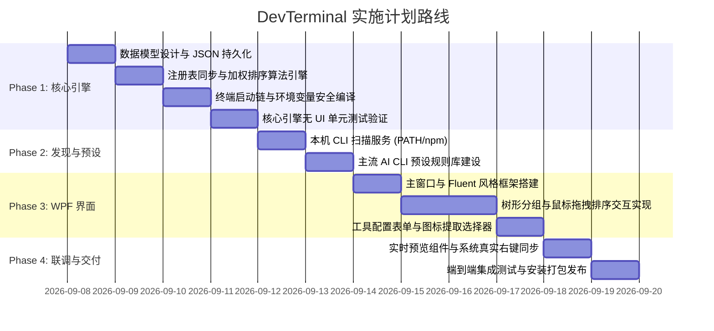

# 开发终端管理工具 (DevTerminal) — 需求与架构规划方案

> 文档版本：v1.0  
> 状态：规划评审通过，待开发  
> 目标平台：Windows 10 / Windows 11  

---

## 一、项目背景与核心价值

### 1.1 核心痛点
随着 AI 驱动开发的普及，开发者本地安装了大量针对特定场景的 CLI 终端工具（例如：**Claude Code**、**OpenCode**、**Codex**、**Kimi CLI**、**Agy**、**Gemini CLI** 等）。日常使用中存在以下痛点：
1. **工作目录流转繁琐**：每次使用都必须在目标项目文件夹打开终端，并手动输入命令，步骤繁琐且机械。
2. **注册表维护成本高**：手动在 `regedit.exe` 的 `Directory\Background\shell` 下添加右键项门槛高、易写错 `%V` 传参及引号转义，且缺少图标提取与管理能力。
3. **右键菜单过度膨胀**：平铺多个 CLI 工具会导致资源管理器右键菜单极其冗长，严重挤占日常操作空间。
4. **终端环境多样且缺少统一管理**：不同 CLI 需要不同的运行宿主（Windows Terminal、CMD、PowerShell、Warp）或需要特定的网络代理环境变量（如 `HTTP_PROXY`）。

### 1.2 解决方案与定位
打造一款专为**开发者（尤其是 AI CLI 重度用户）**设计的本地终端/开发工具右键管理软件：
- **统一可视化配置**：图形化添加、修改、启用/禁用所有开发 CLI 工具。
- **自定义右键菜单文件夹（级联子菜单）**：类似原生“新建 ▷”，支持创建如“AI 编程工具 ▷”，将多个 CLI 工具收拢归纳。
- **全流程拖拽自定义排序**：支持鼠标拖拽调整工具在菜单内的前后顺序。
- **智能探测与一键预设**：自动扫描本机已安装的 AI CLI 工具，并提供常见工具的一键填充模板。
- **免特权安全运行**：100% 用户态注册表（`HKCU`），日常操作完全零 UAC 提权干扰。

---

## 二、技术栈评估与终审决策

抛开历史资产影响，从该工具的核心系统级特征出发，进行横向多方案对比：

| 评估维度 | .NET 10 + WPF (WPF-UI) | Tauri v2 (Rust + 前端) | Wails v3 (Go + Web) | WinUI 3 (Windows App SDK) |
|---|---|---|---|---|
| **注册表与 Win32 原生操作** | **一等 BCL 支持**，无胶水层 | 依赖第三方 crate，处理多类型注册表较繁琐 | 依赖 `golang.org/x/sys/windows` | 原生支持 |
| **图标提取与渲染** | **Win32 Shell 3行代码直连**，直接绑定 UI 控件 | 提取 HICON 需转 Base64 走 IPC 桥接穿透 | 需转 Base64 走桥接 | 原生支持 |
| **终端启动链防注入** | `ProcessStartInfo.ArgumentList` 数组安全传参 | 良好 | 良好 | 原生支持 |
| **拖拽交互与视觉质感** | **成熟 WPF 拖拽模型**，WPF-UI 具备原生 Fluent/Mica 质感 | 前端拖拽生态好，但有 WebView2 运行时开销 | 同 Tauri | 拖拽相对较新，生态小 |
| **冷启动速度** | <600ms（原生无 WebView 初始化） | 需等待 WebView2 引擎冷启动 | 需等待 WebView2 | 中等 |
| **系统侵入性与依赖** | 纯用户态，发布支持单目录自包含 | 纯用户态 | 纯用户态 | MSIX/AppSDK 依赖较重 |

### 🏆 最终选型：**.NET 10 LTS + WPF + WPF-UI + CommunityToolkit.Mvvm**
- **开发语言/框架**：C# 13 / .NET 10 LTS (`net10.0-windows`)
- **界面与样式库**：[WPF-UI](https://wpfui.lepo.co/)（提供原生 Windows 11 Fluent Design、Mica 毛玻璃材质、深浅主题自动跟随与精致现代控件）
- **架构模式**：MVVM（基于 `CommunityToolkit.Mvvm` 源生成器，强类型且零反射性能损耗）
- **构建产物**：免安装绿色版（Portable ZIP）及一键轻量安装包。

---

## 三、核心功能规范与系统架构

### 3.1 菜单组织结构：顶级直出 + 一级级联文件夹
系统支持混合组织模式，用户可自由规划右键形态：
- **顶级直出项**：高频核心工具（如最常用的 Claude Code）直接排布在右键一级菜单，一击即发。
- **自定义菜单文件夹（一级子菜单）**：
  - 用户可创建多个文件夹（如 `📂 AI 编程工具 ▷`、`📂 常用终端 ▷`）。
  - 每个文件夹支持配置：**显示名称（MUIVerb）**、**专属图标（Icon）**、**启用/禁用状态**。
  - **层级约束**：严格限定为**一级子菜单**（右键 ➔ 文件夹 ➔ CLI 工具），避免多层级联导致的鼠标操作容易滑出/误触问题。

```text
📁 文件夹空白处右击
│
├── 🤖 Claude Code (常用直出项)
│
├── 📂 AI 编程工具 ▷  ─────────────────┐ (自定义菜单文件夹)
│                                       ├── 1. OpenCode
│                                       ├── 2. Codex
│                                       └── 3. Kimi CLI
│
├── 📂 调试终端 ▷   ───────────────────┐
│                                       ├── 1. Windows Terminal
│                                       └── 2. Warp
└── 其他系统原有菜单项...
```

---

### 3.2 排序算法与注册表底层映射规范

#### 3.2.1 注册表级联结构标准
在 Windows 静态右键菜单体系中，通过在父级项添加 `SubCommands=""` 并在其子级建立 `shell` 节点，是 Windows 官方支持的标准纯注册表级联实现方式。全部写入当前用户配置：

```ini
; 1. 自定义文件夹（父级）
[HKEY_CURRENT_USER\Software\Classes\Directory\Background\shell\DevTerminal_Folder_010]
"MUIVerb"="AI 编程工具"
"SubCommands"=""
"Icon"="C:\\Path\\To\\FolderIcon.ico"

; 2. 文件夹内的子项（子级 shell 节点）
[HKEY_CURRENT_USER\Software\Classes\Directory\Background\shell\DevTerminal_Folder_010\shell\010_opencode]
"MUIVerb"="OpenCode"
"Icon"="D:\\Software\\nodejs\\opencode.exe"

[HKEY_CURRENT_USER\Software\Classes\Directory\Background\shell\DevTerminal_Folder_010\shell\010_opencode\command]
@="cmd.exe /c cd /d \"%V\" && opencode"
```

#### 3.2.2 自定义拖拽排序底层保障机制
- **原理**：Windows 资源管理器在枚举 `shell` 下的子项时，默认按照**注册表子键名（Key Name）的字典序**展示。
- **实现**：
  - 界面呈现文字完全由注册表中的 `MUIVerb` 字符串决定（对用户完全透明，展示如 "OpenCode"、"Claude Code"）。
  - 底层注册表子键名采用**自增步长加权格式**：`{Order:D3}_{SafeToolId}`（例如 `010_Claude`、`020_OpenCode`、`030_Codex`）。
  - 用户在 UI 列表中拖拽调整顺序后，引擎自动刷新内部顺序索引并重新生成对应键，**确保右键菜单中的实际展示顺序与 UI 拖拽顺序 100% 严格一致**。

---

### 3.3 终端宿主适配链 (Launch Chain)

每个工具支持选择不同的终端承载宿主，针对不同场景优化：

| 终端宿主 | 命令生成模板 | 特性与适用场景 |
|---|---|---|
| **Windows Terminal (`wt.exe`)** | `wt.exe -d "%V" cmd.exe /k "<ExecutablePath>" <Arguments>` | 推荐首选；原生标签页支持，自动以当前右键目录为起始路径 |
| **经典控制台 (`cmd.exe`)** | `cmd.exe /c cd /d "%V" && "<ExecutablePath>" <Arguments>` | 稳定兜底，轻量秒开；参数使用全引号防特殊字符注入 |
| **PowerShell (`pwsh.exe`)** | `pwsh.exe -NoExit -Command "Set-Location -LiteralPath '%V'; & '<ExecutablePath>' <Arguments>"` | 适合 PowerShell 脚本及生态工具 |
| **自定义终端 (Custom)** | 用户自定义模板字符串（支持替换 `%V`、`%EXE%`、`%ARGS%`） | 适配 Warp、WezTerm、Cmder、Git Bash 等各类第三方终端 |

#### 环境变量增强
- 支持在工具配置中指定环境变量（如 `HTTP_PROXY=http://127.0.0.1:7899`、`HTTPS_PROXY=http://127.0.0.1:7899`）。
- 启动时自动在启动命令前缀注入环境参数，确保 AI 终端工具的网络连接顺畅。

---

### 3.4 智能探测与预设中心

#### 3.4.1 自动探测范围
系统启动时或点击“刷新探测”时，无锁扫描以下常用路径：
1. **全局 npm/pnpm/yarn 路径**：扫描 `npm root -g`、`pnpm bin -g`、`AppData\Roaming\npm`、`D:\Software\nodejs` 等，定位 `opencode`, `codex` 等 `.cmd/.exe`。
2. **用户本地工具目录**：扫描 `%USERPROFILE%\.local\bin`（Claude Code 默认安装路径）、`%LOCALAPPDATA%\Programs`。
3. **用户与系统环境变量**：遍历 `PATH` 与 `PATHEXT` 解析有效命令。
4. **Python Scripts 目录**：扫描 Python 全局与虚拟环境中的 AI CLI（如 Kimi 相关 CLI）。

#### 3.4.2 内置预设推荐
识别到已安装的工具后，自动匹配内置预设库，提供一键预填规则：
- **Claude Code**：默认显示名称 `Claude Code`，自动抓取 `claude.exe` 图标，配置工作目录 `%V`。
- **OpenCode**：默认显示名称 `OpenCode AI`，关联 OpenCode 图标，推荐终端为 Windows Terminal。
- **Codex**：默认显示名称 `Codex CLI`。
- **Kimi CLI**：默认显示名称 `Kimi CLI`。
- **快捷引导**：提供“**一键生成 [AI 编程助手] 分组并自动归纳**”快捷向导，初次使用 1 秒完成配置。

---

### 3.5 注册表安全与数据隔离机制

1. **零提权隔离**：
   - 所有写入严格局限于 `HKEY_CURRENT_USER\Software\Classes\Directory\Background\shell`。
   - 完全不需要以管理员身份运行，杜绝系统安全性风险与权限弹窗。
2. **受管项特征标记**：
   - 每个受管键值写入统一特征字符串（如 `DevTerminal.Managed=1`），严禁误读、误改或误删系统原有右键项（如新建、显示设置等）。
3. **配置文件与注册表双向同步**：
   - 核心数据统一持久化在本地标准 JSON 文件（`%APPDATA%\DevTerminal\config.json`）。
   - 每次用户保存时，由 `RegistrySyncEngine` 执行**原子差异对比（Diff & Apply）**：计算需要新增、修改、重命名或删除的键值，执行同步并提供一键清空/复原能力。

---

## 四、UI 界面布局与交互设计

界面采用现代化两栏/卡片工作台设计，支持鼠标全流程拖拽：

```text
┌──────────────────────────────────────────────────────────────────────────────────┐
│  ⚡ DevTerminal - 开发终端右键管理工具                       [ 深浅主题 ] [ ⚙️ 设置 ]  │
├──────────────────────────────────────────────────────────────────────────────────┤
│  🔍 自动检测：本机发现 3 个未配置的 AI CLI 工具 (Claude, OpenCode, Codex)  [ 一键导入 ]  │
├───────────────────────────────┬──────────────────────────────────────────────────┤
│  📂 菜单结构编排 (支持鼠标拖拽排序)│  📝 工具详情配置 (Inspector)                      │
├───────────────────────────────┼──────────────────────────────────────────────────┤
│                               │                                                  │
│  [ ＋ 新建分组 ] [ ＋ 添加工具 ]│  显示名称：[ OpenCode AI              ]          │
│                               │                                                  │
│  ▼ 📂 AI 编程助手 ▷ (3项)  ≡  │  图标路径：[ 🎨 C:\...\opencode.ico   ] [ 浏览... ]│
│    │                          │                                                  │
│    ├─ 🤖 1. Claude Code   ≡   │  归属位置：(●) 放入文件夹 [ AI 编程助手 ▾ ]        │
│    ├─ 💻 2. OpenCode      ≡   │            (○) 一级根菜单直出                    │
│    └─ ⚡ 3. Codex         ≡   │                                                  │
│                               │  终端宿主：[ Windows Terminal (wt.exe)  ▾ ]       │
│  ▼ 📂 常用直出项              │                                                  │
│    │                          │  执行程序：[ D:\...\bin\opencode.exe  ] [ 浏览... ]│
│    └─ 🚀 1. Kimi CLI      ≡   │                                                  │
│                               │  附加参数：[                                     ]│
│  ▼ 📂 调试运维 ▷ (1项)     ≡  │                                                  │
│    │                          │  工作目录：当前右键所在文件夹 (%V)                │
│    └─ 🌐 1. Warp Terminal ≡   │                                                  │
│                               │  网络代理：[✔] 注入 HTTP_PROXY (127.0.0.1:7899)  │
│                               │                                                  │
│                               │  [ 👁️ 效果预览 ]               [ 💾 保存更改 ]    │
├───────────────────────────────┴──────────────────────────────────────────────────┤
│  右键菜单实时效果预览：                                                            │
│  空白处右击 ➔ [ 📂 AI 编程助手 ▷ ] ➔ [ 🤖 1. Claude Code | 💻 2. OpenCode | ⚡ 3. Codex ]│
└──────────────────────────────────────────────────────────────────────────────────┘
```

### 拖拽交互细节：
- **组内排序**：在同一个菜单文件夹内，按住工具项手柄或卡片直接上下拖拽即可直观调换顺序。
- **跨组归属移动**：直接将某个工具拖入目标菜单文件夹，释放后自动将该工具归入该文件夹；拖到根节点即可脱离分组变为一级直出。
- **文件夹排序**：菜单文件夹自身支持上下拖拽调整在右键菜单中的高低位置。

---

## 五、实施路线规划 (Roadmap)



- **Phase 1**：核心模型、注册表加权级联算法与终端命令安全编译，配套单元测试矩阵确保底层健壮。
- **Phase 2**：CLI 自动探测中心与主流 AI 工具预设模板库。
- **Phase 3**：基于 WPF-UI 搭建桌面管理端，重点打磨树形拖拽排序与编辑表单。
- **Phase 4**：实时预览、一键挂载到系统右键、实机右键点击端到端测试与打包交付。

---

*文档说明：本规划方案已正式归档，后续开发与功能演进均以本方案为基准执行。*
